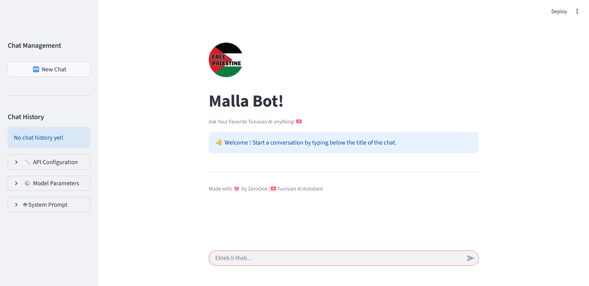
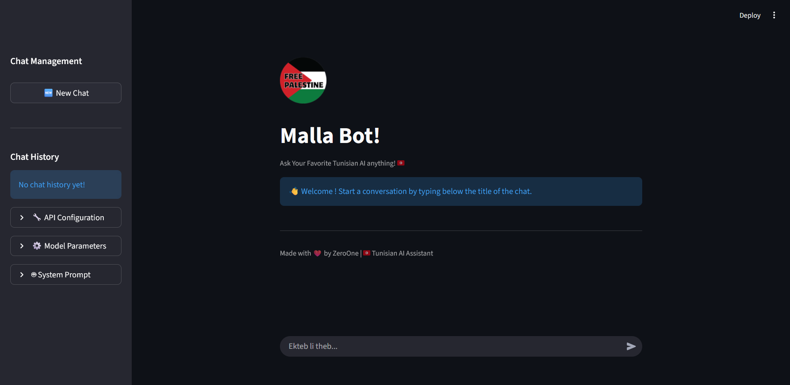
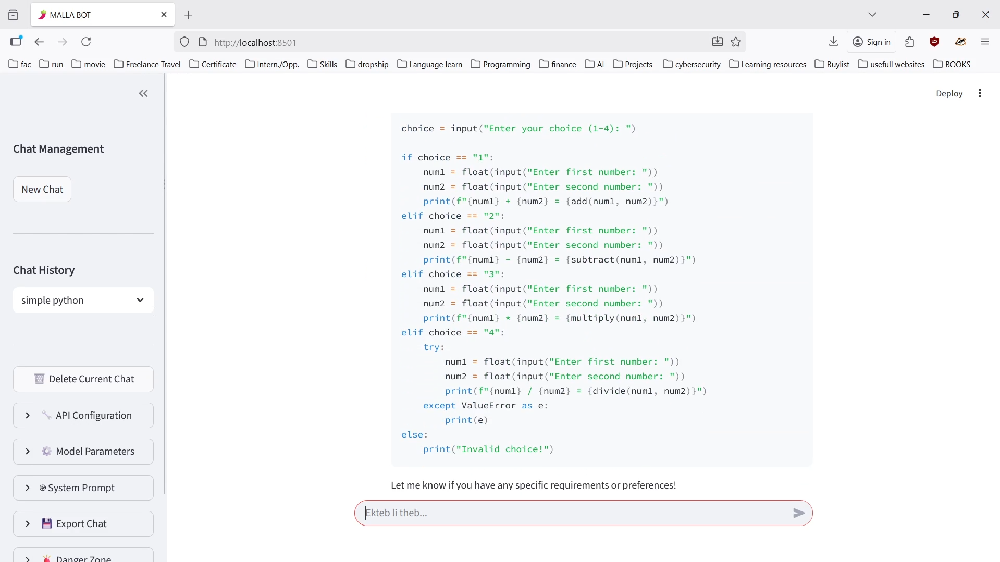

# Malla Bot - Tunisian AI Assistant 🇹🇳

## 📖 Overview

Malla Bot is a sophisticated Streamlit-based chatbot application that will interface with local Ollama models to provide an authentic Tunisian AI experience. While the backend AI integration is in progress, the frontend showcases a complete, professional chat interface with all user-facing features fully implemented.

🔗 **Experience the UI**: [Malla Bot Live Demo](https://mallabot-fcc3rzgyeypgnpmbwse7bc.streamlit.app/)

> ⚠️ **Note**: The UI is fully functional and ready to use, but the Ollama API backend is currently under development. You can explore all the interface features while we work on connecting the AI engine!

## 🎥 Demo Video

*Click the image above to watch the demo video showcasing Malla Bot's features*

## 📸 Screenshots

### Main Chat Interface

*Clean, modern chat interface with Tunisian theme 🇹🇳*

### Sidebar Chat 

*Easy chat history navigation and management*

## ✨ Key Features (UI Ready ✅)

### 💬 **Chat Management**
- **Multiple Chat Sessions**: Create and manage multiple conversation threads
- **Chat History**: Persistent chat history with easy navigation
- **One-Click New Chats**: Start fresh conversations instantly
- **Selective Deletion**: Delete individual chats or clear all history

### ⚙️ **Customizable Parameters**
- **Temperature Control**: Adjust creativity (0.0-1.5)
- **Token Limits**: Set response length (50-4000 tokens)
- **Top-P Sampling**: Control response diversity (0.1-1.0)
- **System Prompts**: Customize AI personality and behavior

### 🔧 **Advanced Configuration**
- **API Endpoint Configuration**: Support for local and remote Ollama instances
- **Connection Testing**: Built-in health checks for API connectivity
- **Export Functionality**: Download chat histories as JSON files
- **Session Management**: Persistent state across browser sessions

## 🎯 What You Can Experience Now

### ✅ **Fully Functional UI Elements:**
- Complete chat interface with message bubbles
- Real-time chat input and display
- Sidebar navigation and chat management
- Parameter sliders and configuration panels
- Export functionality for chat histories
- Responsive design that works on all devices

### 🔄 **Coming Soon (Backend Integration):**
- AI response generation via Ollama
- Real-time streaming responses
- Model inference and processing
- API connectivity and error handling

## 🚀 Quick Preview

1. **Visit the Demo**: Click the link above to see the live interface
2. **Create Chats**: Start new conversation threads
3. **Test Navigation**: Switch between different chat sessions
4. **Adjust Settings**: Play with temperature, tokens, and system prompts
5. **Export Data**: Try the JSON export functionality

## 🛠️ Technical Stack

### Frontend (Ready ✅):
- **Streamlit Framework**: Modern web application
- **Session State Management**: Persistent user data
- **Responsive Design**: Mobile-friendly interface
- **Real-time UI Updates**: Dynamic content rendering

### Backend (In Development 🔄):
- **Ollama Integration**: Local LLM inference
- **REST API Communication**: HTTP request handling
- **Streaming Protocol**: Real-time response processing
- **Error Handling**: Robust connection management

## 📱 Features to Explore in the Demo

### Chat Interface
- Modern chat bubble design
- User/assistant message differentiation
- Smooth scrolling and layout
- Interactive chat input

### Sidebar Controls
- Chat history management
- Model parameter adjustments
- System prompt customization
- API configuration panel

### Utility Features
- JSON export functionality
- Connection testing interface
- Comprehensive error states
- Professional loading indicators

## 🔄 Development Status

| Component | Status | Notes |
|-----------|--------|-------|
| **UI/UX Design** | ✅ Complete | Fully responsive and polished |
| **Chat Management** | ✅ Complete | Session persistence working |
| **Parameter Controls** | ✅ Complete | All sliders functional |
| **Export System** | ✅ Complete | JSON download ready |
| **Ollama Integration** | 🔄 In Progress | Backend development ongoing |
| **AI Responses** | 🔄 Coming Soon | Model connection in progress |

## 🎨 UI Highlights

- **Tunisian Theme**: Red and white color scheme 🇹🇳
- **Professional Layout**: Clean, modern interface
- **Intuitive Navigation**: Easy-to-use controls
- **Visual Feedback**: Clear status indicators
- **Mobile Optimized**: Works on all screen sizes

## 🤝 Get Involved

We're actively developing the AI backend! If you're interested in:
- Testing the full version when ready
- Providing feedback on the UI
- Contributing to development
- Reporting issues or suggestions

Please reach out to the developer below!

## 👨‍💻 Developer

**ZeroOne**  
---

*Explore the future of Tunisian AI with Malla Bot's interface - the brains are coming soon!* 🌶️

🔗 **Live Demo**: [https://mallabot.streamlit.app/](https://mallabot-fcc3rzgyeypgnpmbwse7bc.streamlit.app/)

---

*Screenshots showcase the current UI state. Actual interface may have minor updates.*
